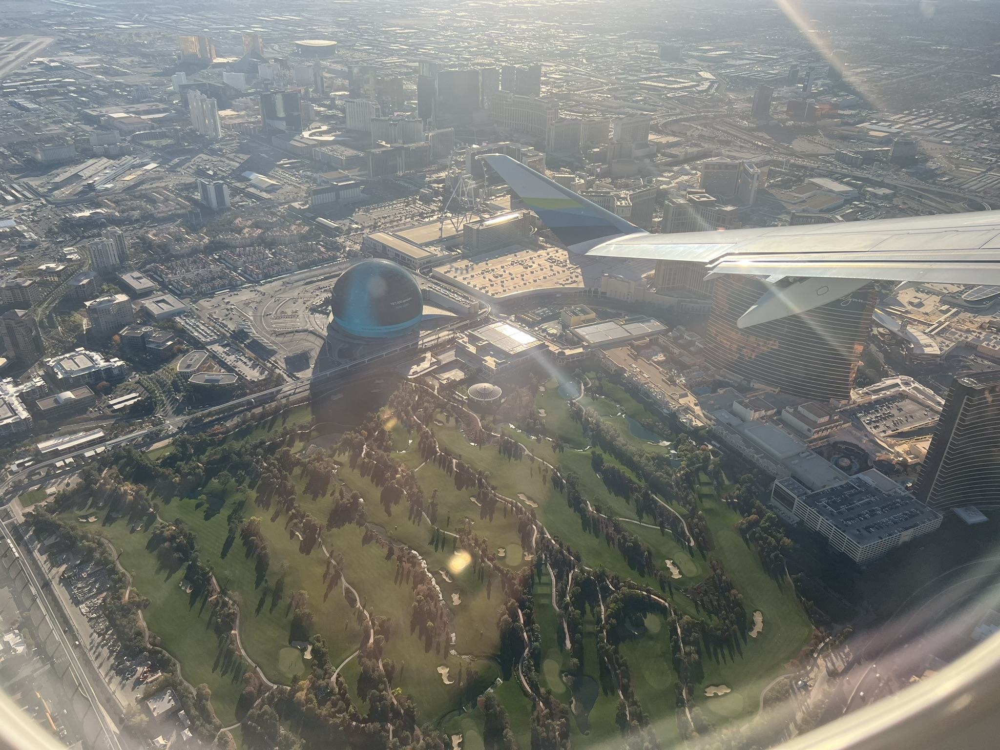

---
title: Indexing iCloud Photos with AI Using LLaVA and pgvector
date: 2024-01-08
--- 

I've been fascinated about the rise of AI. However, for the most of the part, it feels like magic. I like to get to the bottom fo the things as much as possible. My favorite courses at CS Undergrad were Digital Design, Computer Architecture, Operating Systems and Networking, and I was in the 1% in them (except networking, damn Electronics students). I liked them very much. Though my father taught me Visual Basic and databases when I was around 10, taking these courses was finally when it clicked me. It felt like when Neo finally saw the Matrix being just green code in a vertical `<marquee>`, but mine was in a much less cool version of enlightenment: "that's you mean by 64-bit CPU" and "oh okay hyper-threading does mean 2x CPU all the time", and "I know for loop order is important for optimal cache performance in some architectures", "oh internet is 1500 bytes of messages exchanged. it's a miracle it works at this scale" etc.

But, the AI changed everything for me. To be frank, I have almost no idea what's going on with the latest developments. And this is coming from a CS PhD drop-out (partly due to military obligation postponement and partly due to self-discovery process) that had no choice but to take several classical (in other words, boring) AI and Machine Learning courses due to hype and almost no serious professor wanted to work on operating systems, distributing systems and networking (which were my favorite), but only shiny things like Bioinformatics with 50 people in one paper and old machine learning. 

The way the modern AIs work, and you can literally download a bunch of them in a single file and operate in less than 8GB RAM in a M1 machine is fucking amazing. But, as most of us does not need to deal with CPU architectures all the day, we don't have to really understand how matrix multiplication ends up the sand having an artificial intelligence.

For a while, I wanted to play with LLMs and concept of RAG for a while for an internal sue case at [Resmo,](www.resmo.com) but I did not have strong use cases. Let me put out this for once. Adding an AI/LLM powered chatbot to your website for customer support, summarizing documentation or converting natural language to SQL is not useful at all but yeah it probably checks a checkbox somewhere so that you can say you have "AI" in your product.

So, to avoid blabbering any further, in short my hobby project is leveraging a multi-modal LLM that can understand images, and improve the semantic search on my photo archive in iCloud. Apple Photos can already recognize the things on the image and provide a full text search on images. However, it can only detect objects and colors. I found the Google Photos search much better.

# Describing iCloud Photos using LLM

As I said, during my MsC and PhD, I had to take several ML/AI courses and know better that there are state of the art labeling and segmentation algorithms for images that perform very well and work much more efficiently than an LLM. But I want to try this idea. 

How about we ask an LLM and what it sees in an image, and embed the response as a vector using a popular algorithm and let the users search on that? Nothing state of the art, but it's an interesting case. Obviously the performance will be dependent upon the recognition of the LLM, but can an open-source model be good enough to search my photos? If it's good enough, can it evolve into something else? Let's dive in.

For starters, if you are using iCloud Photos, all of your Photos thumbnails are searchable in a local directory, even if all the Photos are not in your Mac due to storage concerns. There is also an SQLite database of your Photos and I had a descriptive blog on it in 2019, however the schemas seem to have changed and you have better luck on the Simon's blog. 

To keep things simple, I made a code to recursively list the jpeg files in the thumbnails folder of iCloud which can be found in `~/Photos/iCloud...`. They are smaller versions of the original photos, but they are more than enough for our use case. As an LLM model, I've chosen LLaVA with Q4 and used the just executable [llamafile](https://github.com/Mozilla-Ocho/llamafile) which makes deployment extremely easy. This has an API that I can call and all I need to do is to encode the images.

## Prompts

I don't like the term prompt engineering. In my opinion, it's not a deep enough subject with several branches to be called actual engineering, it feels like an insult to actual engineering. If we called every trial and error without really understanding the root cause engineering, it would cheapen what real engineering's all about – years of tough study, understanding the nuts and bolts of stuff, not just poking around and seeing what sticks. 

I tried several prompts to understand what would give a better description for the images. Considering each generation takes around 10 seconds on my M1 Max 64GB machine with LLaVA 7B Q4 model (I used the REST API, I'm sure it could be better), I did not have much choice. Since I'm not a PhD student anymore, I will not be releasing anything against benchmarks, but I'll be sharing a few examples on what LLaVA generates with different prompts using different temperatures and compare 7B and 13B parameter models. 

Of course, GPT4V generates perfect descriptions for my images in great detail. But at what cost? All the LLM and RAG examples around blogs and YouTube defaults with OpenAI, and it makes me sad. Don't get me wrong, I'm grateful that they exist, but the ability to run a LLM with vision on your computer is amazing, and we should not be dependent on a single company no matter what they do. I'm an old Linux user and that could not afford a Macbook, and without access to Linux, a free operating system and a package manager, my programming skills would not progress as much as they did. So don't be a simp for a company with a $100 billion valuation and go ahead and support open source LLMs, don't default to proprietary. I'm grateful for the work OpenAI does to advance the area, but there are even special LLMs that can even work on edge.

*Prompt 1*:

```markdown
"A chat between a user and an artificial intelligence assistant. The assistant gives detailed answers to the human's questions.
USER:[img-10]Describe this image in detail
ASSISTANT:"
```

*Prompt 2*:

```markdown
"Concise image summary request.
USER:[img-10] Provide a brief, concise description of this image, highlighting only the most essential elements in a few words.
ASSISTANT:"
```

*Prompt 3*:

```markdown
"Detailed image analysis dialogue.
USER:[img-10] I need a thorough analysis of this image, including all elements, colors, and any noticeable features.
ASSISTANT:"
```

*Prompt 4*:

```markdown
"Interactive session for image analysis and description.
USER:[img-10] Please provide a comprehensive description of this image, focusing on all visible details.
ASSISTANT:"
```

*ChatGPT*

```markdown
Describe this image in detail
```

Some test results:

### Image 1: A flyover over the Sphere



* **Prompt 1**: The image captures a unique aerial view of an airport with multiple large passenger jets parked on the runway. In addition to these planes, there are several cars and trucks visible around the area, likely serving various purposes such as transportation or maintenance for the aircraft.  The scene also features two golf courses located near the airport, one situated closer to the center of the image while another is more towards the left side. These courses provide a contrasting element to the busy airport environment and offer recreational opportunities for visitors in the area. The combination of planes, cars, trucks, and green golf courses creates an interesting snapshot of urban life with aviation infrastructure intertwined within it."

* **Prompt 2**: A plane flying over a golf course.

* **Prompt 3**: The image features a cityscape with an airplane flying overhead, providing a unique perspective of the urban landscape. A large golf course is visible below, adding greenery to the scene. There are numerous cars and trucks scattered throughout the area, indicating that it's likely during daytime when people are commuting or traveling around town.  In addition to these elements, there are several traffic lights in various locations across the city, helping regulate vehicle flow on the streets below. The presence of a large blue airplane soaring above adds an interesting element to this urban landscape photo. Overall, it's a captivating image that showcases both nature and human-made structures coexisting within the same environment.

* **Prompt 4**: The image is an aerial view of a golf course with many trees and green grass. There are several cars parked in the vicinity, as well as some buildings surrounding the area. In addition to the vehicles on land, there's also an airplane visible flying over the golf course. This unique perspective provides insight into both the ground-level activity of people playing or visiting the course and the aerial viewpoint from above. The scene is a blend of nature and urban elements, creating a picturesque environment for those who enjoy outdoor activities like golfing.

* **ChatGPT**: The image depicts a scenic aerial view from an airplane, showcasing a sprawling cityscape bathed in warm sunlight. In the foreground, we see the airplane's wing, giving a sense of height and movement. Below, the city is densely packed with various buildings, including what appear to be large hotel complexes, indicative of a metropolitan area known for tourism. There's a notable structure with a curved, blue-glass roof that stands out from the surrounding architecture. Lush green spaces, possibly golf courses or parks, offer a contrast to the urban environment, with well-manicured lawns and trees dotted throughout. The roads and highways weave through the city, filled with the tiny specks of vehicles, indicating the bustle of city life. The terrain beyond the city becomes more barren, suggesting a desert-like environment surrounding the urban area. The sunlight casts long shadows from the buildings, indicating either sunrise or sunset, adding to the serene ambiance of the scene.

### Image 2: Belgrade The Temple of Saint Sava


* **Prompt 1**: The image features a large, ornate church with two prominent towers and an impressive dome. There are several people walking around the area outside of the church, some carrying handbags or backpacks as they explore the surroundings. A few individuals can be seen standing near the entrance, while others walk along the sidewalk nearby. The overall atmosphere appears to be calm and serene, with visitors enjoying their time at this historic landmark. The church's architecture adds a sense of grandeur to the scene, making it an attractive destination for those who appreciate its beauty and historical significance."

* **Prompt 2**: The image shows a large church with people walking in front of it. A man is seen carrying a pink bag while others are walking around the area, possibly visiting or attending an event at the church. There's also a bench nearby for those who wish to sit and relax during their visit.

* **Prompt 3**: " The image depicts a large, white church with two prominent domes and an ornate clock tower. A crowd of people is gathered outside the building, walking around or standing near it. There are at least 14 individuals visible in various positions within the scene. Some of them have backpacks on their shoulders, suggesting they might be tourists visiting the church. The overall atmosphere appears to be that of a busy day with people engaging in different activities outside the impressive building."

* **Prompt 4**: The image features a large white church with an ornate domed roof and several tall, narrow towers. It is surrounded by lush green trees that add beauty to the scene. A crowd of people can be seen walking around outside the church, enjoying their time in this picturesque setting. In total, there are 13 individuals visible throughout the image; some are closer to the foreground while others are further away. One person is carrying a handbag as they walk through the area near the church. The scene captures a sense of community and leisurely activity in front of this magnificent building.

* **ChatGPT**: This image depicts the front view of a grand church under a clear blue sky with a few wispy clouds. The church has a large central dome topped with a cross and is flanked by smaller domes, all with a green patina. The facade is white with ornamental details and multiple arched entrances, above which there are golden mosaics or paintings. In front of the church, there is a spacious plaza with several people scattered around. A man in a black T-shirt and shorts walks in the foreground carrying a pink file or folder, while to the right, a couple is walking side by side. To the left, a group of people appears to be queuing, possibly to enter the church. Various trees and a monument with inscriptions are also visible in the plaza area. It's a sunny day, and the overall atmosphere is peaceful and leisurely.

### Image 3: Two luggage in hotel room


* **Prompt 1**:  The image features two suitcases placed next to each other on the floor. One of them is larger, occupying most of the space in front of it, while the smaller one stands beside it. Both suitcases are wheeled bags with handles for easy transportation. They appear to be sitting side by side against a wall or corner, possibly waiting to be picked up or placed elsewhere. The overall scene suggests that someone might have recently arrived at their destination or is preparing for travel.

* **Prompt 2**: Two pieces of luggage sitting next to each other.

* **Prompt 3**: The image features a hotel room with two suitcases placed on the floor. One of them is larger and has a handle, while the other one appears to be smaller or possibly broken down into multiple pieces. Both suitcases are positioned next to each other near a wall in the room. The room itself contains various elements such as a bed situated towards the right side of the image, another smaller piece of furniture on the left side, and two chairs located close together at the far end of the room. Additionally, there is an umbrella placed further back within the scene. The presence of these items suggests that this hotel room might be used for temporary accommodation or travel purposes.

* **Prompt 4**: The image displays a hallway with two pieces of luggage placed next to each other. One suitcase is larger and gray, while the second one appears smaller in size. Both are positioned close together on wheels for easy transportation. A handbag can also be seen resting nearby.  In addition to the luggage, there's a backpack located towards the left side of the scene, further emphasizing that this is likely an area used by travelers or commuters. The hallway itself has various patterns and colors on its walls, creating a visually appealing environment for those passing through it.

* **ChatGPT**: The image shows two pieces of luggage placed on a tiled floor against a wall with a striped wallpaper pattern. On the left, there is a smaller, patterned carry-on suitcase with a houndstooth design in black and white. It features a telescopic handle and appears to have two front pockets, one larger than the other. The suitcase also has a small black tag attached to the top handle. Next to it, on the right, is a larger, hard-shell suitcase with a ridged design. It is a light color, possibly gray or off-white, and also features a telescopic handle and four spinner wheels, which is a common feature for ease of movement. The floor is made of polished stone tiles, with a mix of cream, beige, and black marble patterns. The wall behind the suitcases is adorned with a dual-tone striped wallpaper, alternating between beige and a darker tan color. The striping is vertical, and there is a wooden chair rail separating the wallpaper from the wainscoting below. There's a slight shadow cast by the suitcases onto the wall and floor, indicating ambient lighting in the room.

### Image 4: My daughter playing in sand with toys


* **Prompt 1**:  The image features a young girl playing in the sand on a dirt road. She is surrounded by various toys, including several cars and trucks spread across the ground near her. A few other items can be seen as well: two bottles are located towards the right side of the scene, while another car and a spoon are placed closer to the center. The girl appears to be enjoying herself in this playful environment with her sandy creations around her.

* **Prompt 2**: A little girl playing in the sand.

* **Prompt 3**: The image depicts a young girl playing in the sand at a park. She is sitting on her knees, surrounded by various toys such as cars and trucks scattered around her. There are also two teddy bears placed nearby, one closer to the left side of the scene and another towards the right. The child appears engaged with these playthings while enjoying her time in the sandy area.

* **Prompt 4**: The image depicts a little girl playing in the sand, surrounded by various toys. She is wearing pink clothing and appears focused on her playtime activities. There are several cars scattered around her, as well as multiple trucks nearby. Additionally, there's a handbag placed close to one of the vehicles. The scene suggests that this little girl might be enjoying some outdoor fun in a sandy area with various toys and objects for entertainment.

* **ChatGPT**: This image shows a young child playing in a sandbox. The child, appearing to be a toddler, is wearing a pink outfit with their hair pulled up, possibly in pigtails. There is a variety of colorful plastic toys scattered around them, including a yellow dump truck, a red shovel, a blue bucket, and other assorted sand toys. The sand area is bordered by grass on one side, with a small portion of a white boundary marker or line visible. It looks like an outdoor play area, possibly in a backyard or a park. The ground outside the sandbox is covered with grass, and you can see a couple of young trees supported by stakes in the background. It's a sunny day with the shadow of the child visible on the sand, indicating either morning or afternoon.

## Embeddings and pgvector

I remember the emergence of word2vec in my university years, and it felt like a magic back then and still does. As I said, I don't need to understand all the details how it works underneath (but it'd be really helpful), but the fundamentals of it. Given a string, embedding models convert it to a vector that you can run a simple distance algorithm to find related ones or the ones that are similar to your query. Even though I don't care how models are trained and embeddings work, with abstracting that part, I can mvoe on with my life and do multi-dimensional vector similarity. I stored the state of my application on my favorite database Postgres, and with pgvector extension, querying the similarity was extremely easy.

## Python Code for generating descriptions, embeddings and querying them

This is just iterating the files in my iCloud Photo library, prompting local LLaVA using HTTP API.

```py
import os
import psycopg2

from pgvector.psycopg2 import register_vector

conn = psycopg2.connect(user="mustafa", password="", database="postgres")
register_vector(conn)

prompt = "Detailed image analysis dialogue.\nUSER:[img-10] I need a thorough analysis of this image, including all elements, colors, and any noticeable features.\nASSISTANT:"

model = SentenceTransformer('sentence-transformers/all-MiniLM-L6-v2')


for root, dirs, files in os.walk("/Users/mustafa/Pictures/Photos Library.photoslibrary/resources/derivatives/"):
    for name in files:
        x = os.path.join(root, name)
        filename, ext = os.path.splitext(x)
        if ext == ".jpeg":
          response = llm(prompt, x)
          description = response['content']
          embeddings = model.encode(response['description'])
            cur.execute("INSERT INTO results (filename, prompt, model, description, embedding) VALUES(%s, %s, %s, %s)",
                        (x, prompt, json.dumps(response), description), embeddings)
            conn.commit()
```

For querying the data, we use the same embedding model, and just ask pgvector to bring the closest vectors. I did not use any indexing because the data is already small, but pgvector supports indexes like [IVFFlat](https://github.com/pgvector/pgvector#ivfflat) and [HNSW](https://github.com/pgvector/pgvector#hnsw) for faster retrieval with a small hit to correctness. But since these are just image descriptions, I'm sure it would not matter much. 

```py
import ipyplot

from PIL import Image

query = "inside of a shopping mall"
embeddings = model.encode(query)
cur.execute("SELECT filename, description, embedding <-> %s as score FROM results ORDER BY embedding <-> %s LIMIT 5", (embeddings, embeddings))
rows = cur.fetchall()
images = []
labels = []
for row in rows:
    img = Image.open(row[0])
    images.append(img)
    desc = row[1]
    score = row[2]
    labels.append(f'{score:.4f}\n{desc}')

ipyplot.plot_images(images, labels, max_images=30, img_width=350, zoom_scale=1)
```

In the end, I've used the [ipyplot](https://github.com/karolzak/ipyplot) library to show a grid of images with their labels and distance to my query. I've exhausted my Python knowledge and can't wait to go back to writing some Kotlin.

## Results

Well, the results are surprisingly good in my dataset of ~4000 images. I tired different quantization ranging from LLaVA 7B-Q4 to LLaVA 13B-FP16, and it did not matter much for my use case. Of course, if it was an official benchmark, and we had an actual dataset to compare, I'm sure larger models would result in a slightly higher score, but the performance of it is substantially lower and was not worth it in my dataset to fool around.


# What's next?

I like to blog. I like to share my insights and experiences, so it somehow inspires other people or gave an idea. If I see an actual product being built upon any of the ideas here, I would be more than happy. This is my goal. I have no time or relevant experience to pursue further on this idea. Otherwise, instead of this blog, it'd be on a pitch deck. 

There are still possible improvements upon what I've shared so far. A user of this product will likely search for very specific things, like "blue t-shirt baby on Christmas", not paragraphs of data. However, the LLM outputs are much longer than typical user query. I'm not really sure if it is a good idea to run very different string lengths using vector embeddings. 

Additionally, there can be a multi-layered approach that incorporates the labels in the document, metadata of the image, face recognition, combination of multiple prompts for long and short descriptions and some sort of multi-level scoring system that can improve the performance to bring more relevant performance, like how advanced RAGs perform.

Alternatively, you can use OpenAI's GPT4V and embeddings but where is the fun in that?